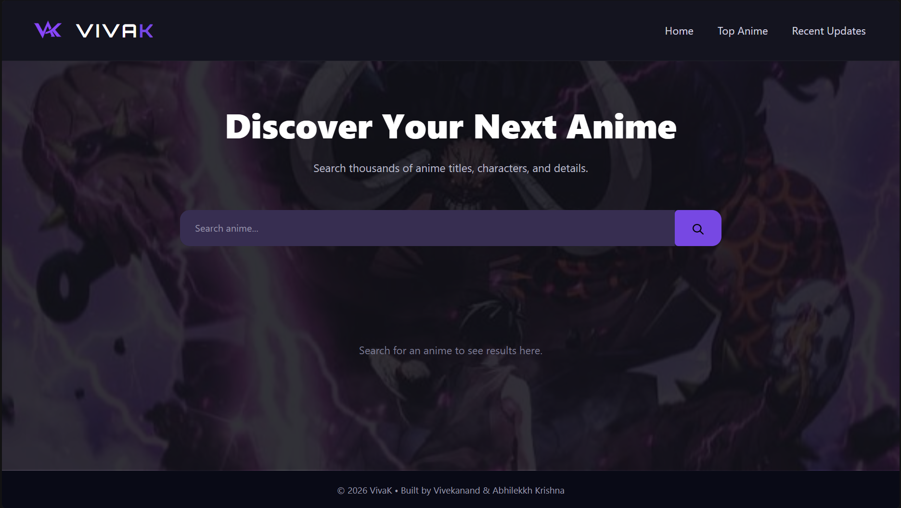
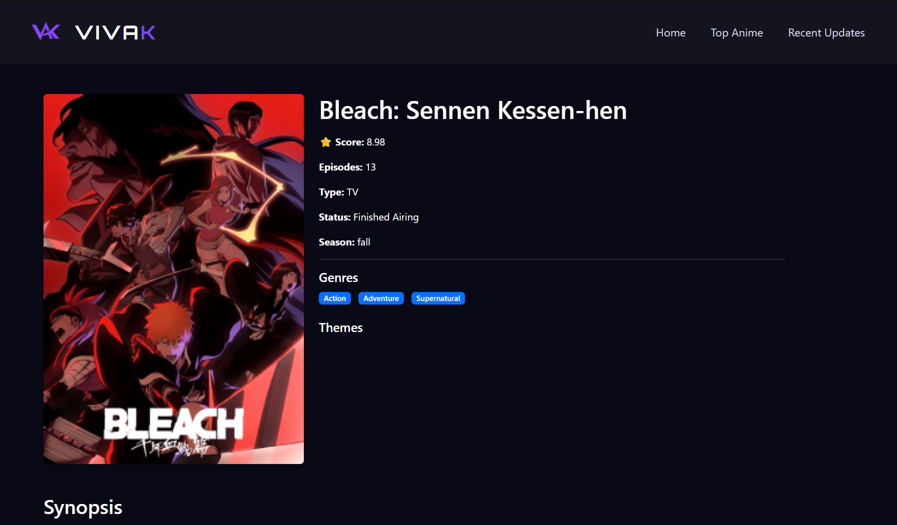
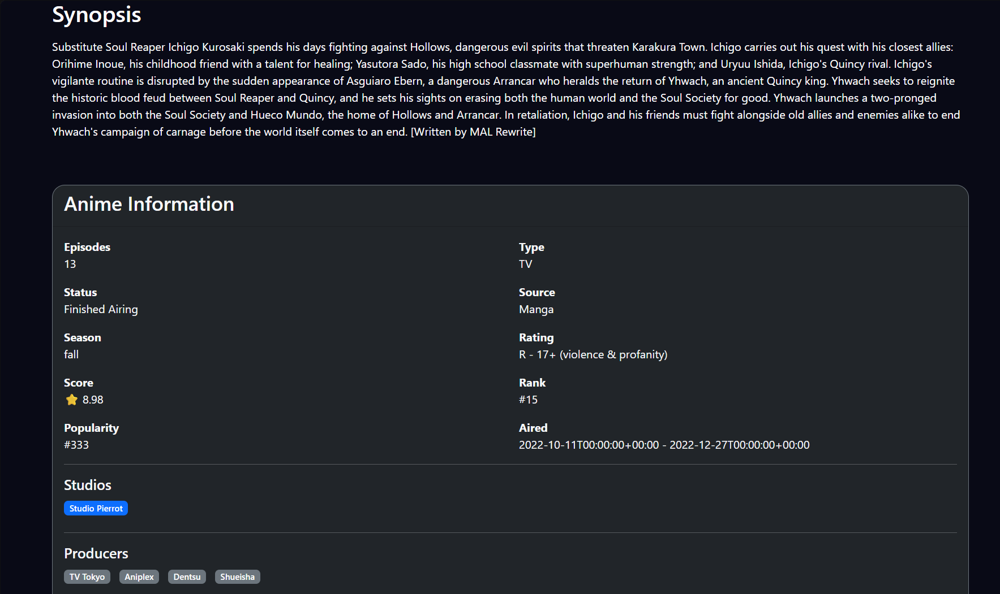
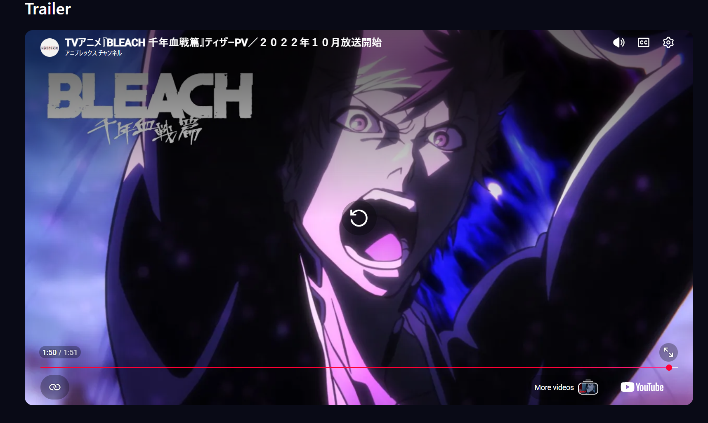
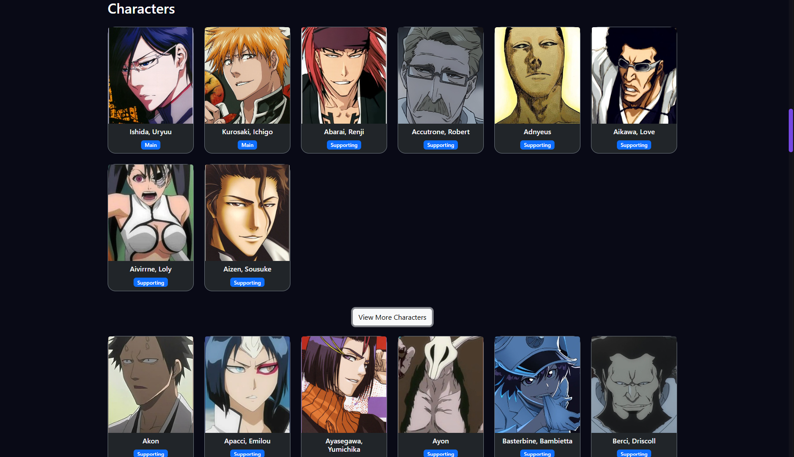
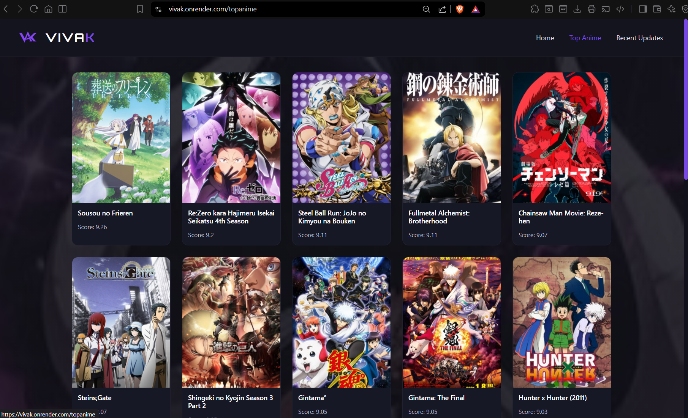
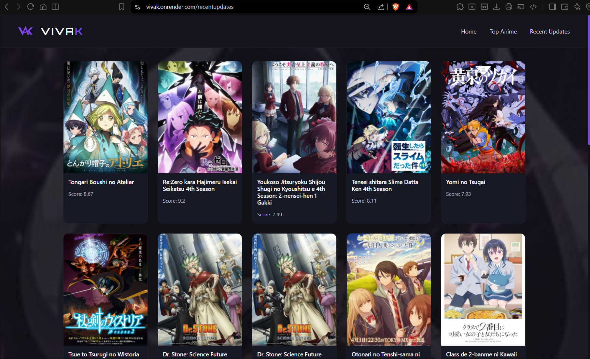

# <h1 align="center">VIVAK</h1>

<p align="center">
  <strong>Anime Discovery Platform built with Flask and the AniList GraphQL API</strong>
</p>

<p align="center">


</p>

<p align="center">
  <a href="https://vivak.onrender.com">
    
  </a>
  <a href="https://github.com/abhilekkh/vivak">
    
  </a>
</p>

---

# About

**VivaK** is a Flask-powered anime discovery platform built using the **AniList GraphQL API**. It enables users to search for anime, explore detailed information, watch trailers, browse character information, discover top-rated anime, and stay updated with the current season's titles through a modern, responsive interface.

The project follows a clean modular architecture that separates routing, API communication, configuration, caching, and data formatting into dedicated modules.

---

# Features

* 🔍 Search anime by title
* 📖 View detailed anime information (episodes, score, status, studios, producers, synopsis and more)
* 👥 Browse anime character listings with roles
* 🎬 Watch official YouTube trailers embedded on the detail page
* ⭐ Browse top-rated anime globally
* 📺 Explore currently airing seasonal anime
* ⚡ Memoized API requests using **Flask-Caching (SimpleCache)** to reduce redundant API calls
* 🔁 Automatic retry with backoff on API failures and rate limits
* 🧩 Modular backend architecture with dedicated API, utility, configuration, and routing layers
* 📱 Responsive Bootstrap 5 interface

---

# Screenshots

## Home Page



---

## Anime Details

<p align="center">
  
  
</p>

<p align="center">
  
  
</p>

---

## Top Anime



---

## Recent Updates



---

# Live Demo

🌐 **https://vivak.onrender.com/**

---

# Project Architecture

The application follows a modular architecture that separates routing, API communication, configuration, caching, and data formatting.

```text
              Browser
                 │
                 ▼
      Flask Routes (app.py)
                 │
                 ▼
    Utility Layer (utils.py)
                 │
                 ▼
Cached API Service Layer (api.py)
                 │
                 ▼
    AniList GraphQL API Server
       (graphql.anilist.co)
```

---

# Tech Stack

## Frontend

* HTML5
* CSS3
* Bootstrap 5
* Jinja2

## Backend

* Python
* Flask
* Flask-Caching
* Gunicorn (production server)

## API

* **AniList GraphQL API** — free, no auth required, highly reliable

---

# Project Structure

```text
VivaK/
│
├── app.py            ← Flask app and all URL routes
├── api.py            ← AniList GraphQL queries, fetch logic, caching
├── utils.py          ← Formats raw API data for templates
├── config.py         ← API base URL and cache object
├── Procfile          ← Gunicorn startup config for Render
├── requirements.txt
│
├── static/
│   ├── favicon.ico
│   ├── logo3.png
│   ├── style.css
│   └── screenshots/
│       ├── home.png
│       ├── details_1.png
│       ├── details_2.png
│       ├── details_3.png
│       ├── details_4.png
│       ├── top_anime.png
│       └── recent_anime.png
│
├── templates/
│   ├── base.html
│   ├── index.html
│   ├── anime_detail.html
│   ├── top_anime.html
│   └── updates.html
│
└── Readme.md
```

---

# Installation

```bash
# Clone the repository
git clone https://github.com/abhilekkh/vivak.git

# Navigate into the project
cd vivak

# Create and activate a virtual environment
python -m venv env
env\Scripts\activate      # Windows
source env/bin/activate   # macOS/Linux

# Install dependencies
pip install -r requirements.txt

# Run the application
python app.py
```

Then open `http://127.0.0.1:5000` in your browser.

---

# Contributors

## Y.V.S. Vivekanand

* Designed the basic Flask backend architecture and overall structure
* Built the Search feature with UI, routes, and live result rendering
* Integrated the AniList GraphQL API for real-time anime data
* Built the frontend interface using custom CSS styling
* Implemented responsive layouts, hover effects, and overall UI refinement

## Abhilekkh Krishna

* Developed the Anime Details module
* Implemented Character Listing functionality
* Built the Top Anime and Recent Updates pages
* Integrated additional API endpoints
* Implemented API caching using Flask-Caching
* Enhanced the UI using Bootstrap and improved responsiveness
* Migrated backend from Jikan (MyAnimeList) to AniList GraphQL API
* Added retry logic and production deployment config (Procfile)

---

# Future Improvements

* 🔹 Pagination for anime listings
* 🔹 Search autocomplete
* 🔹 Advanced filtering (genre, year, type)
* 🔹 User favorites and watchlists
* 🔹 Redis-based caching for production persistence
* 🔹 Dark/Light theme toggle
* 🔹 User authentication

---

# Acknowledgements

* **AniList** for the free, reliable GraphQL anime API
* **Flask** and the open-source Python community
* **Bootstrap** for the responsive UI components

---

# Support

If you found this project useful, consider giving the repository a ⭐ on GitHub!

It helps the project reach more people and motivates future improvements.